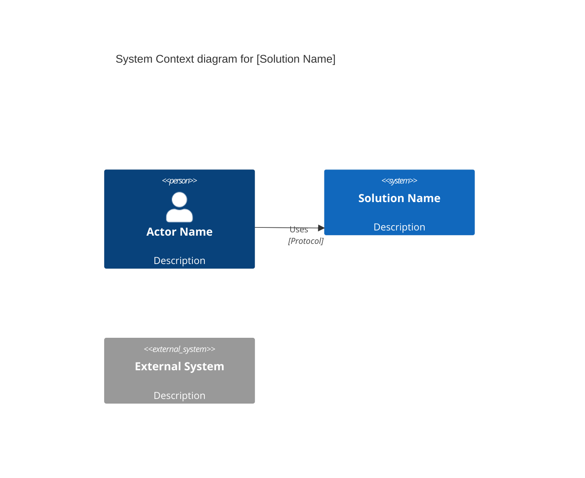
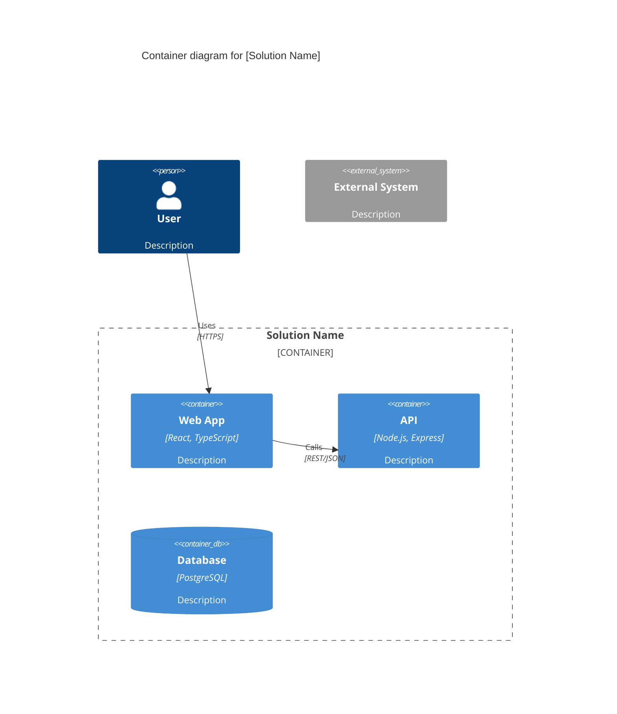
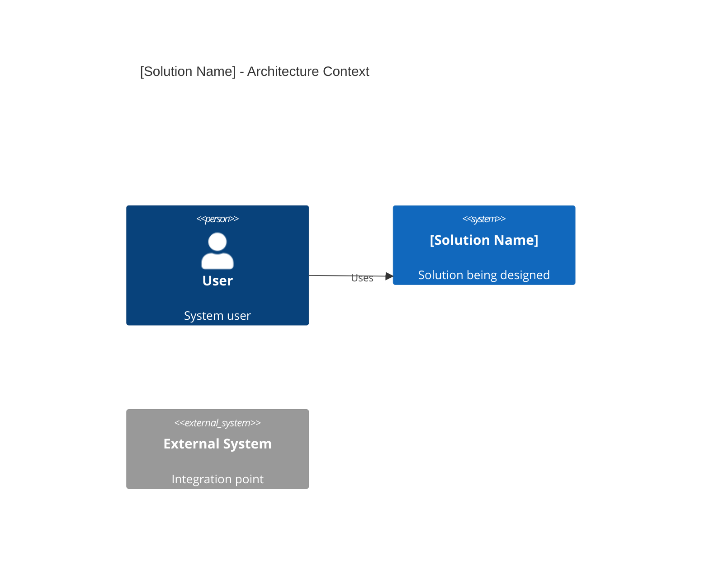

# Contract: Solution Design Document Schema

**Feature**: Imagine Command for Solution Design  
**Date**: 2026-02-03  
**Purpose**: Define the structure and validation rules for generated solution design documents

---

## Overview

This contract specifies the exact structure of `solution-design.md` files generated by `/speckit.imagine`. It serves as:
- **Template specification** for solution-design-template.md implementation
- **Validation criteria** for generated documents
- **Integration contract** for downstream tools (e.g., /speckit.specify parsing features)

---

## Document Structure

### 1. Frontmatter (YAML)

**Format**: YAML block delimited by `---`  
**Position**: First lines of file  
**Required**: Yes

```yaml
---
title: string                 # Solution name (required)
created: YYYY-MM-DD           # ISO date format (required)
version: string               # v1, v2, v3... (required)
artifact_count: integer       # Number of processed artifacts (required)
last_updated: YYYY-MM-DD      # ISO date format (optional, same as created for new docs)
---
```

#### Validation Rules

- `title`: Non-empty string, 1-100 characters
- `created`: Valid ISO 8601 date (YYYY-MM-DD)
- `version`: Must match pattern `v\d+` (v1, v2, v3, ...)
- `artifact_count`: Non-negative integer
- `last_updated`: Valid ISO 8601 date, must be >= created date

#### Example

```yaml
---
title: Customer Portal Modernization
created: 2026-02-03
version: v1
artifact_count: 7
last_updated: 2026-02-03
---
```

---

### 2. Main Title (Heading 1)

**Format**: `# [Title] - Solution Design`  
**Position**: Immediately after frontmatter  
**Required**: Yes

**Validation**: Title must match frontmatter `title` field

**Example**:
```markdown
# Customer Portal Modernization - Solution Design
```

---

### 3. Executive Summary (Section 1)

**Heading**: `## 1. Executive Summary`  
**Content**: 2-4 paragraphs, 300-600 words total  
**Required**: Yes

**Structure**:
1. **Problem Statement**: What business need or pain point is being addressed?
2. **Solution Approach**: High-level description of proposed solution
3. **Key Capabilities**: 3-5 primary features or capabilities delivered
4. **Stakeholders**: Who will use, benefit from, or maintain the solution?

**Validation Rules**:
- Minimum 2 paragraphs
- Maximum 4 paragraphs
- Word count: 300-600 words
- No code blocks or technical implementation details
- Business-focused language (readable by non-technical stakeholders)

**Example**:
```markdown
## 1. Executive Summary

The current customer portal, built in 2015, suffers from poor mobile responsiveness, 
slow page load times (averaging 8 seconds), and lacks modern features such as real-time 
order tracking. Customer satisfaction scores related to the portal have declined from 
4.2/5 to 3.1/5 over the past two years. Support tickets related to portal usability 
have increased by 60%.

The proposed modernization delivers a responsive web application built on current 
technology standards, with a mobile-first design approach. The solution includes 
real-time order tracking, integrated chat support, and self-service account management. 
Performance improvements target sub-2-second page loads and support for 10,000 
concurrent users.

Key capabilities include: (1) Mobile-responsive interface with native app-like 
experience, (2) Real-time order tracking with push notifications, (3) AI-powered 
chatbot for common inquiries, (4) Self-service returns and exchanges, and (5) 
Personalized product recommendations based on order history.

Primary stakeholders include retail customers (end users), customer service 
representatives (who will use admin dashboard), marketing team (for campaign management), 
and IT operations (who will maintain the platform). The solution integrates with 
existing ERP and CRM systems to ensure data consistency.
```

---

### 4. Architecture Overview (Section 2)

**Heading**: `## 2. Architecture Overview`  
**Required**: Yes  
**Subsections**: 2.1 System Context, 2.2 Container Architecture

#### 4.1 System Context - C4 Context Diagram

**Heading**: `### 2.1 System Context (C4 Context Diagram)`  
**Content**: Mermaid C4Context code block + description  
**Required**: Yes

**Code Block Format**:
````markdown

````

**Description Format**:
```markdown
**Key Elements:**
- **Actors**: [List actors and their roles]
- **System Boundary**: [Describe what's inside/outside the solution]
- **External Integrations**: [List external systems and their purpose]
```

**Validation Rules**:
- Must be valid Mermaid C4Context syntax (pass `mermaid-diagram-validator`)
- Must include `title` directive
- Must have at least 1 Person or Person_Ext element
- Must have at least 1 System element
- Must have at least 1 Rel (relationship) element
- Maximum 7 Person/Person_Ext elements
- Maximum 10 System/System_Ext elements
- Description must list key elements

#### 4.2 Container Architecture - C4 Container Diagram

**Heading**: `### 2.2 Container Architecture (C4 Container Diagram)`  
**Content**: Mermaid C4Container code block + description  
**Required**: Yes

**Code Block Format**:
````markdown

````

**Description Format**:
```markdown
**Key Components:**
- **[Container Name]** ([Technology]): [Purpose and responsibilities]
- **[Container Name]** ([Technology]): [Purpose and responsibilities]

**Technology Stack:**
- Frontend: [Technologies]
- Backend: [Technologies]
- Data: [Technologies]
- Integration: [Technologies]
```

**Validation Rules**:
- Must be valid Mermaid C4Container syntax (pass `mermaid-diagram-validator`)
- Must include `title` directive
- Must have at least 1 Container_Boundary
- Must have at least 1 Container, ContainerDb, or ContainerQueue element
- All containers must include technology stack (3rd parameter)
- Maximum 15 container elements total
- Description must list key components with technologies

---

### 5. Features (Section 3)

**Heading**: `## 3. Features`  
**Content**: List of feature subsections  
**Required**: Yes (minimum 1 feature)

**Feature Subsection Format**:

```markdown
### Feature N: [Feature Name]

**Description**: [1-3 sentence description of user value, 50-300 characters]

**Source**: [Artifact link] - See page [N], section "[Section Name]"
*OR*
**Source**: Agent Clarification - [YYYY-MM-DD] - Question: "[Question text]"

**Assumptions**:
- [Assumption 1]
- [Assumption 2]
```

**Validation Rules**:

1. **Feature Name**: 
   - Noun phrase (e.g., "User Authentication", "Order Tracking")
   - 2-8 words
   - No special characters except hyphens

2. **Description**:
   - 1-3 sentences
   - 50-300 characters
   - Must describe user value, not implementation
   - No code or technical jargon

3. **Source** (exactly one required):
   - **Artifact source**: `[filename](path/to/file)` markdown link + location reference
   - **Clarification source**: Format `Agent Clarification - YYYY-MM-DD - Question: "..."`
   - Cannot have both artifact and clarification sources
   - Cannot have neither (must have one)

4. **Assumptions** (optional):
   - Bulleted list
   - Each assumption is complete sentence
   - Only include if information was inferred
   - If no assumptions, omit this field

**Feature Ordering**: Features should be listed in priority order (high-priority features first)

**Examples**:

````markdown
### Feature 1: User Authentication

**Description**: Users must be able to securely log in using email and password with multi-factor authentication support. Session management includes automatic timeout after 30 minutes of inactivity.

**Source**: [requirements.pdf](solution-artifacts/requirements.pdf) - See page 12, section "Security Requirements"

**Assumptions**:
- OAuth integration for social login deferred to Phase 2
- Password complexity requirements follow NIST SP 800-63B guidelines

---

### Feature 2: Real-Time Order Tracking

**Description**: Customers can view current status of their orders with live updates as packages move through the delivery network. Push notifications alert users of status changes.

**Source**: [customer-feedback.docx](solution-artifacts/customer-feedback.docx) - See section 3.2 "Top Feature Requests"

---

### Feature 3: API Rate Limiting

**Description**: Public API endpoints enforce rate limiting to prevent abuse. Standard tier allows 1000 requests per hour per API key.

**Source**: Agent Clarification - 2026-02-03 - Question: "What performance and scalability requirements apply to the API?"

**Assumptions**:
- Premium tier rate limits to be defined based on customer demand
- Rate limit headers (X-RateLimit-Limit, X-RateLimit-Remaining) follow RFC 6585
````

---

### 6. Assumptions & Open Questions (Section 4)

**Heading**: `## 4. Assumptions & Open Questions`  
**Content**: Bulleted lists of assumptions and open questions  
**Required**: No (conditional - include only if needed)

**When to include**:
- Clarifications were incomplete (couldn't answer all unknowns)
- Major assumptions made that affect solution design
- Open questions identified during artifact analysis

**Format**:

```markdown
## 4. Assumptions & Open Questions

**Assumptions**:
- [General assumption not specific to a feature]
- [Another general assumption]

**Open Questions**:
- [Question that needs stakeholder validation]
- [Technical decision deferred]
```

**Validation Rules**:
- Can be omitted if no general assumptions or open questions
- Feature-specific assumptions should be in feature sections, not here
- Each item should be actionable or validatable

**Example**:

```markdown
## 4. Assumptions & Open Questions

**Assumptions**:
- Solution will be hosted in AWS (artifact mentioned "cloud" without specifying provider)
- Compliance requirements follow GDPR and CCPA (artifacts mentioned "data privacy" generically)
- Initial rollout targets North American users only, international expansion in Phase 2

**Open Questions**:
- What is the budget range for initial implementation? (affects technology choices)
- Are there existing API rate limits or quotas with third-party services?
- Does the organization have preferred vendors for payment processing?
```

---

### 7. Next Steps (Section 5)

**Heading**: `## 5. Next Steps`  
**Content**: Actionable recommendations  
**Required**: Yes

**Format**:

```markdown
## 5. Next Steps

1. **Create Detailed Specifications**: Use `/speckit.specify [feature-name]` to create detailed specs for priority features:
   - Feature 1: [Name]
   - Feature 2: [Name]

2. **Technical Planning**: [Any technical decisions that need to be made]

3. **Stakeholder Review**: [Any validations or approvals needed]

4. **[Other recommendations]**
```

**Validation Rules**:
- Minimum 1 next step
- First step should reference `/speckit.specify` if features exist
- Each step should be actionable and specific
- Use numbered list format

**Example**:

```markdown
## 5. Next Steps

1. **Create Detailed Specifications**: Use `/speckit.specify [feature-name]` to create detailed specs for priority features:
   - Feature 1: User Authentication
   - Feature 2: Real-Time Order Tracking
   - Feature 3: Admin Dashboard

2. **Technology Validation**: Conduct POC for real-time notification system (WebSockets vs. Server-Sent Events vs. polling)

3. **Stakeholder Review**: Present C4 diagrams to architecture review board for feedback on integration approach

4. **Security Assessment**: Engage security team to review authentication and authorization approach

5. **Effort Estimation**: Use detailed specifications to create story point estimates and sprint planning
```

---

## Complete Document Template

````markdown
---
title: [Solution Name]
created: YYYY-MM-DD
version: v1
artifact_count: [N]
last_updated: YYYY-MM-DD
---

# [Solution Name] - Solution Design

## 1. Executive Summary

[2-4 paragraphs: problem statement, solution approach, key capabilities, stakeholders]

## 2. Architecture Overview

### 2.1 System Context (C4 Context Diagram)

```mermaid
C4Context
  title System Context diagram for [Solution Name]
  [diagram content]
```

**Key Elements:**
- **Actors**: [List]
- **System Boundary**: [Description]
- **External Integrations**: [List]

### 2.2 Container Architecture (C4 Container Diagram)

```mermaid
C4Container
  title Container diagram for [Solution Name]
  [diagram content]
```

**Key Components:**
- **[Component]** ([Tech]): [Description]
- ...

**Technology Stack:**
- Frontend: [Technologies]
- Backend: [Technologies]
- Data: [Technologies]

## 3. Features

### Feature 1: [Name]

**Description**: [1-3 sentences]

**Source**: [Artifact link] - See [location]
*OR*
**Source**: Agent Clarification - [date] - Question: "[question]"

**Assumptions**: (if applicable)
- [Assumption]

---

### Feature 2: [Name]
[repeat structure]

## 4. Assumptions & Open Questions (optional)

**Assumptions**:
- [General assumption]

**Open Questions**:
- [Open question]

## 5. Next Steps

1. **Create Detailed Specifications**: Use `/speckit.specify [feature-name]` for:
   - Feature 1: [Name]
   - Feature 2: [Name]

2. **[Other next steps]**
````

---

## Validation Checklist

Before writing `solution-design.md`, validate:

- [ ] Frontmatter is valid YAML with all required fields
- [ ] Title in frontmatter matches main heading
- [ ] Executive summary is 2-4 paragraphs, 300-600 words
- [ ] C4Context diagram passes `mermaid-diagram-validator`
- [ ] C4Container diagram passes `mermaid-diagram-validator`
- [ ] At least 1 feature defined
- [ ] Every feature has exactly one source (artifact or clarification)
- [ ] All artifact references are valid file paths in `./solution-artifacts/`
- [ ] Feature descriptions are 1-3 sentences, 50-300 characters
- [ ] Next steps section includes `/speckit.specify` recommendation
- [ ] Markdown formatting is valid (no broken links, proper heading hierarchy)
- [ ] No sensitive information (credentials, API keys, PII) included

---

## Integration Points

### For `/speckit.specify` Command

When user runs `/speckit.specify [feature-name]`:

1. Parse `solution-design.md` (or latest version)
2. Find feature with matching name (case-insensitive)
3. Extract:
   - Feature description
   - Source reference
   - Assumptions
4. Pre-populate new spec with this information:
   - "Background" section: Include feature description and source
   - "Assumptions" section: Carry forward assumptions
   - "Input" field: Reference solution design document

### For Version Control

- All solution design files are plain markdown
- Commit history shows evolution of design (v1 → v2 → v3)
- Diagrams render in GitHub/GitLab markdown viewers
- Diffs show textual changes to diagrams and features

### For Documentation Generation

- Frontmatter enables automated index generation
- C4 diagrams can be extracted for presentations
- Features can be exported to Jira/Azure DevOps/etc.
- Artifact references support traceability matrices

---

## Error Handling

### Invalid Diagram Syntax

If Mermaid validation fails:

**Fallback**:
````markdown

````

Include note after diagram:
```markdown
⚠️ **Note**: Diagram validation failed. This is a placeholder - please review and complete manually.
```

### Missing Source for Feature

If feature cannot be traced to artifact or clarification:

**Fallback**:
```markdown
**Source**: UNKNOWN - Unable to determine source from artifacts or clarifications
```

Include in "Assumptions & Open Questions":
```markdown
- Feature "[Feature Name]" requires stakeholder validation - source unclear from provided artifacts
```

### No Features Extracted

If no features can be identified:

**Fallback Section 3**:
```markdown
## 3. Features

⚠️ **No features identified** from the provided artifacts. This may indicate:
- Artifacts contain primarily background information
- Additional clarification questions needed
- Manual feature definition required

**Recommendations**:
1. Review artifacts for functional requirements or user stories
2. Run `/speckit.imagine` again with additional artifacts
3. Manually define features in this section
```

---

## Summary

This contract defines:
- ✅ Exact structure of solution design documents
- ✅ Validation rules for each section
- ✅ Integration points with `/speckit.specify`
- ✅ Error handling and fallback strategies
- ✅ Complete template for implementation

**Next**: Implement `solution-design-template.md` based on this contract
