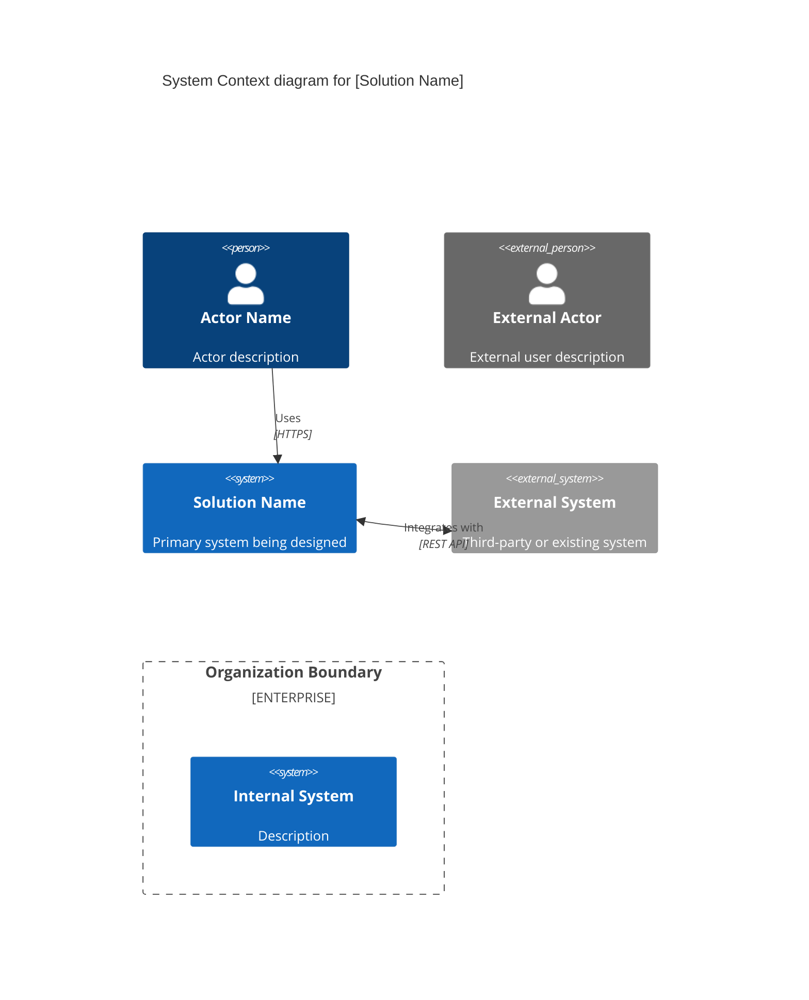
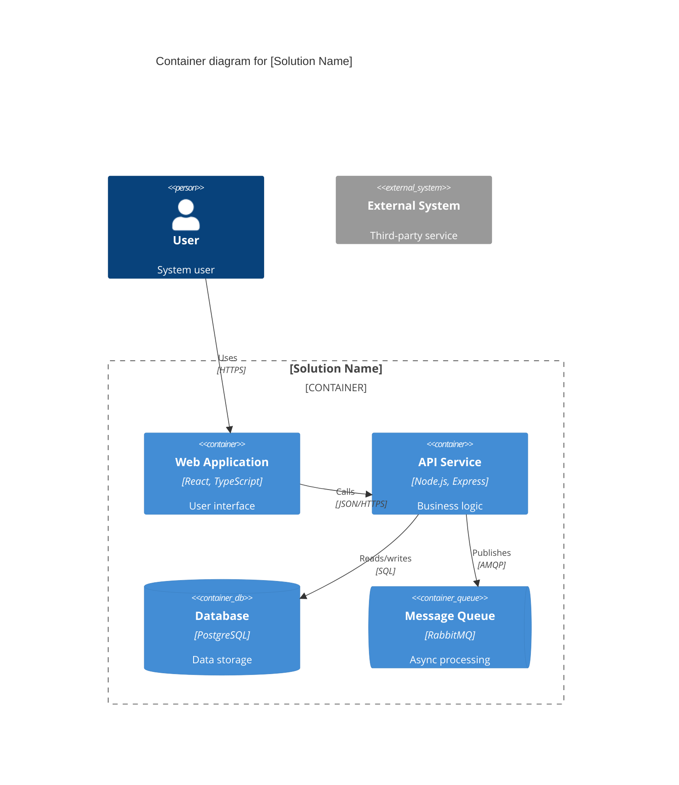

# Research: Imagine Command Implementation

**Feature**: Imagine Command for Solution Design  
**Date**: 2026-02-03  
**Purpose**: Resolve technical unknowns before implementation

---

## 1. Mermaid C4 Diagram Syntax

### Decision: Use Mermaid C4Context and C4Container diagram types

**Rationale**: Mermaid's C4 diagram support provides standardized syntax for architecture visualization that renders in GitHub markdown viewers and most documentation platforms.

**Implementation Approach**:

#### C4Context Diagram Structure


#### C4Container Diagram Structure


#### Validation Strategy

**Tool**: Use `mermaid-diagram-validator` before writing diagrams to files

**Workflow**:
1. Generate diagram code as string
2. Call `mermaid-diagram-validator(code="...")`
3. Check validation response for errors
4. Fix any syntax errors
5. Write validated diagram to solution-design.md
6. Optional: Use `mermaid-diagram-preview` to visually verify rendering

**Common Pitfalls to Avoid**:
- Missing closing braces `}` for boundaries
- Invalid alias names (use alphanumeric only, no hyphens/underscores)
- Undefined aliases in relationships (define elements before using in Rel())
- Missing required parameters (all elements need at least alias and label)
- Styling before element definition (define first, style later if needed)

#### Complexity Guidelines

**C4Context**:
- 3-7 actors (people) maximum
- 5-10 systems maximum
- 1-3 boundaries
- Focus on high-level external interactions

**C4Container**:
- 5-15 containers maximum
- Include technology stack (3rd parameter)
- Use appropriate container types:
  - `Container()` - applications, services, APIs
  - `ContainerDb()` - databases
  - `ContainerQueue()` - message queues
  - `Container_Ext()` - external/third-party containers
- 1-2 container boundaries

**Warning**: C4 diagrams are marked as **experimental** in Mermaid. Syntax may change in future versions.

---

## 2. Artifact Processing Patterns

### Decision: Use agent's native file reading capabilities with graceful fallback

**Rationale**: Different AI agents (GitHub Copilot, Claude, Gemini) have varying file reading capabilities. Solution should leverage whatever the agent supports without requiring external tools.

**Implementation Approach**:

#### Supported File Types (Based on Common Agent Capabilities)

| Format | Extraction Method | Agent Support | Notes |
|--------|------------------|---------------|-------|
| **PDF** | Agent file read + text extraction | Most agents | Works best with text-layer PDFs |
| **DOCX** | Agent file read + XML parsing | Most agents | Modern Word format |
| **TXT/MD** | Direct file read | All agents | Plain text, markdown |
| **Images** | OCR/Vision (if available) | GitHub Copilot (vision), Claude (vision) | Graceful fallback if unavailable |

#### Processing Pattern

```markdown
For each file in ./solution-artifacts/:
1. Check file extension
2. If supported format:
   a. Attempt extraction using agent capabilities
   b. On success: Add content to analysis context
   c. On failure: Log error, continue with other files
3. If unsupported format:
   a. Skip file
   b. Add to warning list
4. Track processing status for progress reporting
```

#### Error Handling Strategy

**No artificial limits** (per Q1 clarification):
- Process all files regardless of count or size
- Performance may degrade with very large datasets
- User responsible for managing artifact volume

**Progress reporting** (per Q3 clarification):
- Display "Processing [filename]..." for each file
- Show spinner/progress indicator during extraction
- Summarize errors at end: "Processed: 8/10 files. Failed: 2 (see details below)"

**OCR/Vision handling** (per Q2 clarification):
- If agent supports OCR/vision: Attempt extraction from images
- If not supported or fails: Skip with warning "Image file [filename] skipped - OCR not available"
- Continue processing other artifacts

**Extraction failures**:
- Corrupted files → Log error, continue
- Password-protected → Log "Unable to access password-protected file", continue
- Unsupported format → List supported formats, skip with warning

---

## 3. Agent Question Patterns (from clarify.md)

### Decision: Adapt clarify.md interactive questioning pattern for solution design context

**Rationale**: The clarify.md command has a well-established pattern for structured, interactive questions with multiple-choice options and reasoning. This pattern should be adapted for solution design clarification questions.

**Key Pattern Elements**:

#### Question Structure

1. **Maximum 5 questions** (hard limit)
2. **Priority order**: Security > Integration > Data > Performance > UX
3. **One question at a time** (sequential, not batched)
4. **Format options**:
   - Multiple choice (2-5 options) with recommendation
   - Short answer (≤5 words) with suggestion

#### Multiple-Choice Format

```markdown
## Question [N] of 5

**Recommended:** Option [X] - [reasoning why this is best]

[Brief context for the question]

| Option | Description |
|--------|-------------|
| A | [Option A description with implications] |
| B | [Option B description with implications] |
| C | [Option C description with implications] |
| Short | Provide a different short answer (≤5 words) |

You can reply with the option letter (e.g., "A"), accept the recommendation by saying "yes" or "recommended", or provide your own short answer.
```

#### Short-Answer Format

```markdown
## Question [N] of 5

**Suggested:** [proposed answer] - [reasoning]

[Brief context for the question]

Format: Short answer (≤5 words). You can accept the suggestion by saying "yes" or "suggested", or provide your own answer.
```

#### Solution Design Question Categories

Based on spec requirements (FR-015), prioritize questions about:

1. **Security** (Priority 1)
   - Authentication approach (SSO, OAuth, username/password, etc.)
   - Authorization model (RBAC, ABAC, simple roles)
   - Data encryption requirements (at rest, in transit, both, none)

2. **Integration** (Priority 2)
   - API types (REST, GraphQL, gRPC, message-based)
   - Integration patterns (sync, async, event-driven, batch)
   - External system dependencies (identify which systems)

3. **Data** (Priority 3)
   - Data persistence requirements (SQL, NoSQL, file system, cloud storage)
   - Data volume expectations (thousands, millions, billions of records)
   - Data retention/archival policies

4. **Performance** (Priority 4)
   - Scalability requirements (users, requests/sec, geographic distribution)
   - Response time expectations (real-time, <1s, <5s, batch acceptable)
   - Availability requirements (24/7, business hours, best-effort)

5. **User Experience** (Priority 5)
   - Primary user interfaces (web, mobile, API-only, desktop)
   - Accessibility requirements (WCAG compliance level)
   - Localization needs (single language vs. multi-language)

#### Answer Integration

After each answer:
1. Create/update `## Clarifications` section in spec
2. Add `### Session YYYY-MM-DD` subsection
3. Append bullet: `- Q: [question] → A: [answer]`
4. Update relevant spec sections (requirements, entities, constraints)
5. Save spec file (atomic update per answer)

#### Termination Conditions

- All 5 questions asked
- User says "done", "stop", "proceed"
- No more high-impact unknowns remain

---

## 4. Solution Design Best Practices

### Decision: Follow C4 model with lightweight feature documentation

**Rationale**: Industry standard approach balances rigor with pre-sales/scoping time constraints. C4 model provides clear abstraction levels (Context → Container → Component → Code), and we'll implement the first two levels.

**Structure Standards**:

### Solution Design Document Template Structure

```markdown
---
title: [Solution Name]
created: [YYYY-MM-DD]
version: v1
artifact_count: [N]
---

# [Solution Name] - Solution Design

## 1. Executive Summary

[2-4 paragraphs covering:]
- Problem statement / business need
- Proposed solution approach
- Key capabilities delivered
- Primary stakeholders / users

## 2. Architecture Overview

### 2.1 System Context (C4 Context Diagram)

[Mermaid C4Context diagram]

**Description:**
- Lists actors (who will use the system)
- Shows system boundary
- Identifies external systems and integrations

### 2.2 Container Architecture (C4 Container Diagram)

[Mermaid C4Container diagram]

**Description:**
- Major system components (web apps, APIs, databases, queues)
- Technology choices (language, frameworks)
- Component interactions and data flows

## 3. Features

### Feature 1: [Feature Name]

**Description**: [1-3 sentences describing user value]

**Source**: [Artifact link] - See page [N], section "[Section Name]"  
*OR*  
**Source**: Agent Clarification - [YYYY-MM-DD] - Question: "[What was asked]"

**Assumptions**:
- [List any assumptions if information was inferred]

### Feature 2: [Feature Name]
[Same structure repeated]

## 4. Assumptions & Open Questions

[Optional section if some information is still unclear after clarifications]

- Assumption: [What was assumed]
- Open Question: [What still needs validation]

## 5. Next Steps

- Create detailed specifications for priority features using `/speckit.specify`
- [Other recommended actions]
```

**Level of Detail Guidelines**:

- **Summary**: Business-focused, 300-600 words total
- **Diagrams**: Show high-level structure, not implementation details
- **Features**: User value statement + source + assumptions (1-3 sentences each)
- **Avoid**: Technology deep-dives, code examples, detailed data schemas

**Quality Criteria**:
- Non-technical stakeholders can understand summary and features
- Technical stakeholders can understand architecture approach from diagrams
- Sufficient detail for effort estimation without referring back to artifacts
- 100% feature traceability (artifact link or clarification reference)

---

## 5. Script Integration Points

### Decision: Follow setup-plan.sh pattern for workflow orchestration

**Rationale**: Existing setup scripts provide JSON output with paths and context. The imagine workflow should follow the same pattern for consistency.

**Script Responsibilities**:

#### setup-imagine.sh (Bash)

```bash
#!/bin/bash

# Purpose: Orchestrate imagine workflow - check prerequisites, setup paths

# 1. Validate environment
#    - Check we're in a spec-kit initialized project (look for .specify/ or similar marker)
#    - Optionally check for feature branch (may not be required for solution design phase)

# 2. Check/create artifact directory
mkdir -p ./solution-artifacts

# 3. Output JSON with paths
cat << EOF
{
  "ARTIFACTS_DIR": "./solution-artifacts",
  "OUTPUT_FILE": "./solution-design.md",
  "TEMPLATE": ".specify/templates/solution-design-template.md",
  "ARTIFACT_COUNT": $(ls -1 ./solution-artifacts 2>/dev/null | wc -l | tr -d ' ')
}
EOF

# 4. Exit codes
#    0 = success
#    1 = not in spec-kit project
#    2 = other errors
```

#### setup-imagine.ps1 (PowerShell)

```powershell
#!/usr/bin/env pwsh

# Purpose: Windows/PowerShell equivalent of setup-imagine.sh

# 1. Validate environment
# 2. Check/create artifact directory
# 3. Output JSON with paths
# 4. Same exit codes

# Mirror bash script logic exactly
```

**Parameter Passing Pattern**:

From command template (imagine.md) to script:
```markdown
scripts:
   sh: scripts/bash/setup-imagine.sh --json
   ps: scripts/powershell/setup-imagine.ps1 -Json
```

From script output to agent:
```json
{
  "ARTIFACTS_DIR": "./solution-artifacts",
  "OUTPUT_FILE": "./solution-design.md", 
  "TEMPLATE": ".specify/templates/solution-design-template.md",
  "ARTIFACT_COUNT": 5
}
```

Agent parses JSON and:
1. Reads all files from ARTIFACTS_DIR
2. Loads TEMPLATE as base structure
3. Generates content (summary, diagrams, features)
4. Determines output filename with versioning:
   - If OUTPUT_FILE doesn't exist → use as-is
   - If exists → auto-version (solution-design-v2.md, v3.md, etc.) per Q4 clarification
5. Writes final document

**No CLI tool required**: Unlike other commands that might need `specify` CLI, the imagine command works entirely through agent interaction with files and scripts.

---

## Alternatives Considered

### Mermaid Diagrams vs. Other Formats

**Considered**:
- PlantUML (richer C4 support but requires Java)
- Draw.io XML (visual but not text-based)
- ASCII art (portable but limited)

**Selected**: Mermaid C4 diagrams
- Native markdown support (renders in GitHub, VS Code)
- No external tools required
- Text-based (version control friendly)
- Sufficient for pre-sales/scoping needs

**Trade-off**: Limited to Context and Container levels (no Component or Code diagrams), experimental status in Mermaid

### Artifact Processing: Agent vs. External Tools

**Considered**:
- External tools (pdftotext, docx2txt, tesseract OCR)
- Python libraries (PyPDF2, python-docx, pytesseract)
- Agent-native capabilities

**Selected**: Agent-native with graceful degradation
- No additional dependencies
- Works across different agent types
- Simpler deployment

**Trade-off**: Extraction quality varies by agent capability, OCR may not be available

### Question Pattern: Batch vs. Sequential

**Considered**:
- Batch all questions upfront
- Sequential one-at-a-time (clarify.md pattern)
- Adaptive questioning (change based on earlier answers)

**Selected**: Sequential with priority ordering
- Better user experience (not overwhelming)
- Can skip later questions if answered by earlier clarifications
- Follows established clarify.md pattern

**Trade-off**: Requires more interaction rounds, can't parallelize

---

## Dependencies & Prerequisites

### Required for Implementation

1. **Mermaid validation tool** - Available via `mermaid-diagram-validator`
2. **Agent file reading** - Native to GitHub Copilot and other agents
3. **Bash + PowerShell** - Cross-platform script execution
4. **Markdown processing** - Native to agents for template manipulation

### Optional (Graceful Degradation)

1. **OCR/Vision capabilities** - If available, extract from images; otherwise skip with warning
2. **Advanced PDF parsing** - Best-effort text extraction

### No External Dependencies Required

- No npm packages
- No Python libraries
- No CLI tools beyond what spec-kit already uses
- No API services

---

## Risk Assessment

| Risk | Likelihood | Impact | Mitigation |
|------|-----------|--------|------------|
| Mermaid C4 syntax changes (experimental status) | Medium | Medium | Validate all diagrams before writing, document current syntax version |
| OCR unavailable on some agents | High | Low | Graceful fallback with clear warning message |
| Large artifacts cause timeouts | Low | Medium | Progress reporting shows user what's happening, no artificial limits imposed |
| Invalid traceability links | Medium | Medium | Validate artifact file paths exist before writing links |
| Diagram too complex to render | Low | Low | Follow complexity guidelines (5-15 containers max) |
| Sensitive data in artifacts | High | High | User responsible for review (Q5 clarification), document this clearly |

**Critical Risks Addressed**:
- **Experimental Mermaid syntax**: Validation before writing + documentation of workarounds
- **Sensitive data exposure**: Clear user warning in documentation + no auto-sanitization policy
- **Agent capability variance**: Graceful degradation pattern handles differences

---

## Summary

All technical unknowns have been resolved:

1. ✅ **Mermaid C4 Syntax**: Validated approach with C4Context and C4Container diagrams, validation strategy using mermaid-diagram-validator
2. ✅ **Artifact Processing**: Agent-native file reading with graceful fallback for OCR, progress reporting with error summary
3. ✅ **Question Patterns**: Adapted clarify.md sequential questioning with solution design priorities
4. ✅ **Solution Design Standards**: C4 model structure with lightweight feature documentation for pre-sales/scoping use case
5. ✅ **Script Integration**: Following setup-plan.sh pattern for JSON-based path orchestration

**Ready for Phase 1**: Data model, contracts, and quickstart guide can now be generated with confidence.
