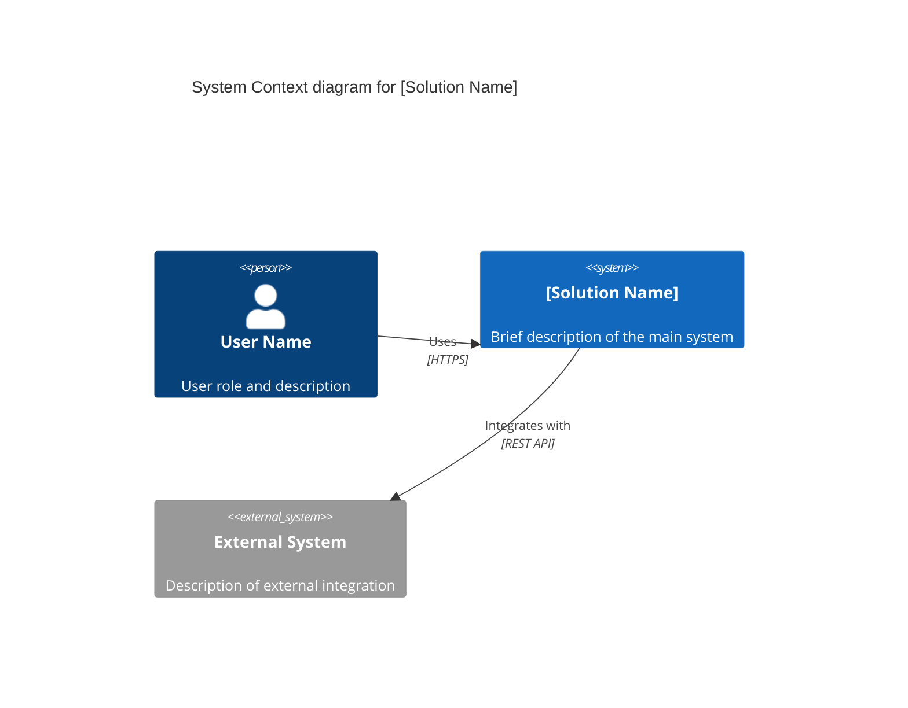
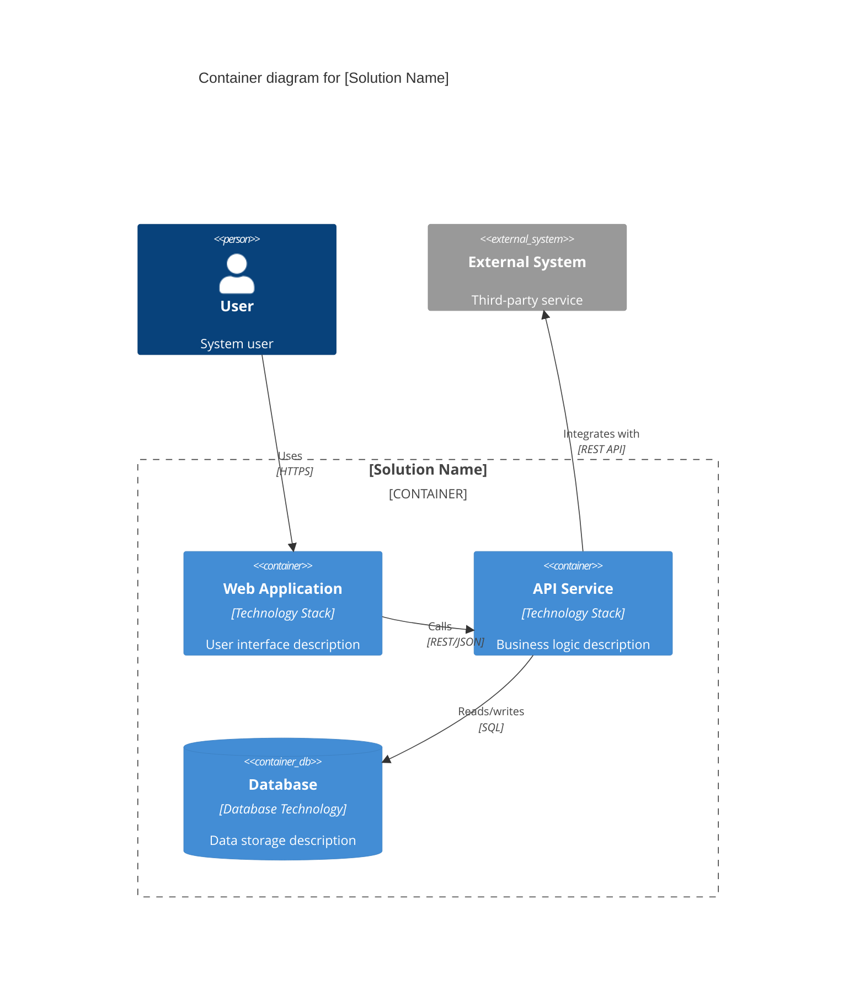

# [Solution Name] - Solution Design

## 1. Executive Summary

[2-4 paragraphs describing:
1. Problem Statement: What business need or pain point is being addressed?
2. Solution Approach: High-level description of proposed solution
3. Key Capabilities: 3-5 primary features or capabilities delivered
4. Stakeholders: Who will use, benefit from, or maintain the solution?

Target: 300-600 words total, business-focused language suitable for non-technical stakeholders]

## 2. Architecture Overview

### 2.1 System Context (C4 Context Diagram)

**Key Elements:**
- **Actors**: [List primary actors (users, administrators, external systems) and their roles]
- **System Boundary**: [Describe what is inside the solution vs external dependencies]
- **External Integrations**: [List external systems and their purpose in the architecture]

### 2.2 Container Architecture (C4 Container Diagram)

**Key Components:**
- **[Component Name]** ([Technology]): [Purpose and responsibilities]
- **[Component Name]** ([Technology]): [Purpose and responsibilities]
- **[Component Name]** ([Technology]): [Purpose and responsibilities]

**Technology Stack:**
- Frontend: [Technologies and frameworks]
- Backend: [Technologies and frameworks]
- Data: [Database and storage technologies]
- Infrastructure: [Cloud platform, orchestration, etc.]

## 3. Features

### Feature 1: [Feature Name]

**Description**: [1-3 sentences describing the feature and its user value, 50-300 characters]

**Source**: [artifact-file.pdf](solution-artifacts/artifact-file.pdf) - See page X, section "Section Name"

**Assumptions**: (if applicable)
- [Assumption about implementation or requirements]
- [Assumption about integration or dependencies]

---

### Feature 2: [Feature Name]

**Description**: [1-3 sentences describing the feature and its user value, 50-300 characters]

**Source**: Agent Clarification - YYYY-MM-DD - Question: "[What was asked to clarify this feature?]"

---

### Feature 3: [Feature Name]

**Description**: [1-3 sentences describing the feature and its user value, 50-300 characters]

**Source**: [artifact-file.docx](solution-artifacts/artifact-file.docx) - See section "Section Name"

## 4. Assumptions & Open Questions

**Assumptions**:
- [General assumptions made during solution design]
- [Assumptions about technical constraints or requirements]
- [Assumptions about integration points or external dependencies]

**Open Questions**:
- [Questions that need stakeholder clarification]
- [Areas requiring further investigation]
- [Decisions deferred to detailed specification phase]

## 5. Next Steps

1. **Create Detailed Specifications**: Use `/speckit.specify [feature-name]` to create comprehensive specifications for:
   - Feature 1: [Feature Name]
   - Feature 2: [Feature Name]
   - Feature 3: [Feature Name]

2. **Architecture Review**: Schedule review with technical leadership to validate architecture approach

3. **Stakeholder Validation**: Review solution design with business stakeholders to confirm alignment with business goals

4. **Prototype**: Consider creating proof-of-concept for high-risk or novel technical approaches

5. **Estimation**: Break down features into development tasks for timeline and resource planning
